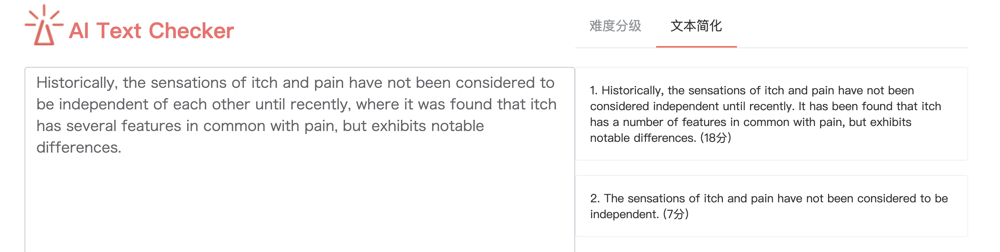

# monk-text-simplification

本项目是窦帅（北京大学信息科学技术学院研究生）对于文本简化任务自主设计的paraphrase+classification模型项目源码，文本简化的输入是一个复杂句子，然后通过对于进行复杂单词的替换，删除，改写等操作，输出一个简单句子。

## code

本仓库所有模型代码（除PPLM文件夹）均为本人从零开始独立创作，PPLM代码借鉴自论文原始实现，并将其从只支持decoder的可控生成改成支持encoder-decoder架构的可控生成。

evaluate是将我们生成模型进行服务封装，实现随意给定一个句子，用模型生成简化句子。本人已经部署到服务器上，可以直接访问 https://www.deltareading.com/about/aiTools.html 进行在线体验。（注意选择右侧文本简化）

assetGetRes文件夹中为对asset数据集的测试代码，相关模型由于体积较大，已经上传到北大网盘，下载后可以直接运行。

t5train文件夹为训练t5模型，需要新创建数据文件夹wiki-auto。wiki-auto数据来源：https://github.com/chaojiang06/wiki-auto

Bertclaasification文件夹为训练Bert难度评定器，需要创建数据文件夹wikiData. 我们默认wikilarge的source为复杂句子，target为简单句子。数据来源：https://www.aclweb.org/anthology/D17-1062/

bartTrain为训练bart文本压缩模型，所用的是fairseq训练，直接运行train_bart.sh,用bart生成则运行generate_bart.py脚本

PPLM文件夹为对原始PPLM代码进行更改，t5discrim_v1.1.py 代表训练复杂简单句子的discriminator，run_pplm.py 代表运行pplm生成句子。

### motivation

之前的任务主要采用的方式是seq2seq的有监督学习,但是这种有监督的训练有一个缺点那就是数据集的质量不高。文本简化训练集是wikipedia和简单wiki-pedia。简单wikipedia是Google专门针对青少年出的对wikipedia的简化版本。但是因为二者之间句子的对齐是机器自动对齐的，所以会导致很多句子对不是互相对应的关系。数据集本身质量很差。有监督模型训练出来的效果也就不是很理想,所以我们希望通过一种无监督的方式来实现文本的简化。

## model

为此我们把简化任务看成一个改写加分类任务。训练一个改写模型，对于一个输入的复杂句子，输出多个改写版本的句子。然后训练一个句子难度复杂度的分类器用来对句子的难度进行评定，之后将之前生成的多个改写句子输入到分类器中，最终输出一个最简单的句子。

我们的模型在输入端，把句子输入t5-paraphrase模型中输出多个候选句子，最终用一个bert难度判别器来输出最简单的句子作为我们的输出。但是这样模型遇到一个问题，因为是paraphrase模型，所以模型输出句子的长度和原始复杂句子长度基本一致，而reference的句子长度普遍小于原始复杂句子，因此我们在输入前进行一个BART句子压缩预处理，对于长句子能够首先进行一个句子压缩的预处理，然后输入到我们模型中去。

